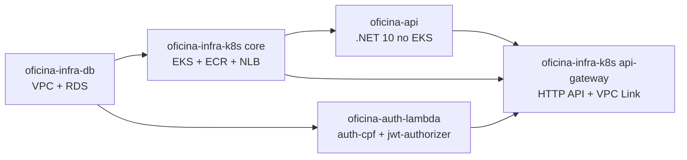
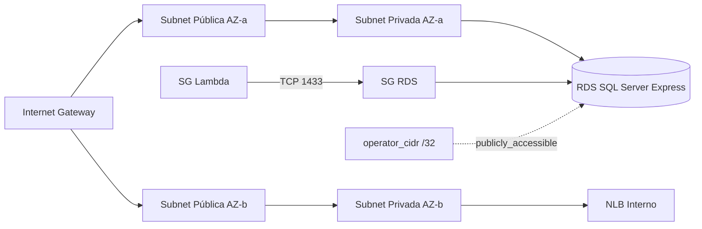

# oficina-infra-db

## Visão geral

Repositório que provisiona a base de rede e banco de dados da solução Oficina na AWS. Cria VPC, subnets públicas e privadas, Security Groups e a instância Amazon RDS SQL Server Express.

- Provisiona a base de rede (VPC, subnets públicas e privadas, Internet Gateway, Security Groups) e a instância RDS SQL Server Express.
- Expõe outputs consumidos pelos demais repositórios via remote state S3 e via filtros AWS CLI.
- Não cria roles IAM, ECR, EKS, Lambdas, API Gateway nem DNS público.

## Tecnologias utilizadas

- Terraform
- AWS VPC, Subnets, Internet Gateway, Security Groups
- AWS RDS SQL Server Express
- AWS S3 (state remoto)
- GitHub Actions

## Solução integrada

A solução Oficina é composta por 4 repositórios que formam um sistema de gestão de oficina mecânica na AWS.



| Passo | Repositório | Quando aplicar |
|---|---|---|
| 1 | [oficina-infra-db](https://github.com/fabianorodrigues/oficina-infra-db) | sempre |
| 2 | [oficina-infra-k8s](https://github.com/fabianorodrigues/oficina-infra-k8s) — core | sempre |
| 2a | [oficina-infra-k8s](https://github.com/fabianorodrigues/oficina-infra-k8s) — addons | apenas se `LOAD_BALANCER_PROVISIONING_MODE=aws_lbc` |
| 3 | [oficina-api](https://github.com/fabianorodrigues/oficina-api) | sempre |
| 4 | [oficina-auth-lambda](https://github.com/fabianorodrigues/oficina-auth-lambda) | sempre |
| 5 | [oficina-infra-k8s](https://github.com/fabianorodrigues/oficina-infra-k8s) — api-gateway | sempre |
| 6 | [oficina-api](https://github.com/fabianorodrigues/oficina-api) — redeploy | se o pod precisar refletir `public-base-url` em e-mails |

Cada README detalha apenas a responsabilidade do seu repositório. Para o passo a passo dos demais, consulte os READMEs correspondentes.

## Arquitetura



## Configuração

Configure em `GitHub > Settings > Secrets and variables > Actions`.

### Obrigatório

| Nome | Tipo | Descrição |
| --- | --- | --- |
| `AWS_ACCESS_KEY_ID` | Secret | Credencial AWS |
| `AWS_SECRET_ACCESS_KEY` | Secret | Credencial AWS |
| `AWS_REGION` | Secret | Região AWS |
| `TF_STATE_BUCKET` | Secret | Bucket S3 do state; criado automaticamente pelo workflow se não existir, com versionamento, criptografia AES256 e bloqueio público |
| `TF_VAR_db_username` | Secret | Usuário administrador do SQL Server (1 a 128 caracteres, começa com letra) |
| `TF_VAR_db_password` | Secret | Senha do SQL Server (8 a 128 caracteres) |

### Opcional

| Nome | Tipo | Default | Descrição |
| --- | --- | --- | --- |
| `AWS_SESSION_TOKEN` | Secret | — | Credenciais temporárias (STS) |
| `TF_VAR_operator_cidr` | Secret | vazio (RDS privado) | IPv4 `/32` para acesso operacional ao RDS; preenchido habilita `publicly_accessible=true` e libera TCP `1433` |
| `PROJECT_NAME` | Variable | `oficina` | Prefixo lógico em nomes e tags |
| `ENVIRONMENT` | Variable | `dev` | Ambiente |
| `TF_VAR_aws_region` | Variable | `us-east-1` | Região AWS aplicada ao provider |
| `TF_VAR_vpc_cidr` | Variable | `10.30.0.0/16` | CIDR da VPC |
| `TF_VAR_db_instance_class` | Variable | `db.t3.micro` | Classe RDS |
| `TF_VAR_allocated_storage` | Variable | `20` | Armazenamento em GB (20 a 100) |
| `TF_VAR_backup_retention_period` | Variable | `0` | Retenção de backup em dias (0 a 35) |

## Execução

Pull requests executam `Terraform Check` com `fmt`, `init -backend=false` e `validate`.

Após o merge na `main`, execute manualmente:

```text
GitHub Actions > Terraform Apply > Run workflow
```

O workflow prepara o backend S3, executa `plan`, aplica o Terraform e valida o estado do RDS sem imprimir connection string, endpoint ou valores sensíveis.

## Validação

### Console

- Em S3, confirme o bucket de state com versionamento, criptografia e bloqueio público.
- Em VPC, confirme subnets públicas e privadas com as tags do projeto.
- Em RDS, confirme a instância `available`, engine SQL Server Express e acesso público apenas quando `TF_VAR_operator_cidr` estiver configurado.
- Em Security Groups, confirme TCP `1433` restrito ao `/32` quando o acesso operacional estiver habilitado.

### CLI (PowerShell)

```powershell
$env:AWS_REGION="<regiao>"
$env:TF_STATE_BUCKET="<bucket-de-state>"
$env:PROJECT_NAME="oficina"

aws s3api get-bucket-versioning --bucket $env:TF_STATE_BUCKET --query "Status"
aws rds describe-db-instances --db-instance-identifier "$($env:PROJECT_NAME)-sqlserver" --region $env:AWS_REGION --query "DBInstances[0].{Status:DBInstanceStatus,Engine:Engine,PubliclyAccessible:PubliclyAccessible}"
aws ec2 describe-subnets --region $env:AWS_REGION --filters "Name=tag:Repository,Values=oficina-infra-db" --query "length(Subnets)"
```

## Observabilidade

A camada de dados expõe métricas nativas do RDS via CloudWatch. Não há agente externo neste repositório.

### Configurar

- Não há secrets adicionais. As métricas básicas do RDS (`CPUUtilization`, `DatabaseConnections`, `FreeStorageSpace`, `ReadIOPS`, `WriteIOPS`) são publicadas automaticamente no namespace `AWS/RDS`.
- Enhanced Monitoring e Performance Insights estão desabilitados por padrão. Para habilitá-los, edite `monitoring_interval` e `performance_insights_enabled` em `terraform/rds.tf`.

### Executar

Nada a executar — as métricas básicas são habilitadas automaticamente pelo RDS na criação da instância.

### Validar

Console: CloudWatch > Metrics > AWS/RDS, confirme série temporal para `DBInstanceIdentifier=<projeto>-sqlserver`.

CLI (PowerShell):

```powershell
$env:AWS_REGION="<regiao>"
$env:PROJECT_NAME="oficina"

aws cloudwatch list-metrics --namespace "AWS/RDS" `
  --dimensions Name=DBInstanceIdentifier,Value="$($env:PROJECT_NAME)-sqlserver" `
  --region $env:AWS_REGION --query "length(Metrics)"
```

## Próxima etapa

Executar [oficina-infra-k8s](https://github.com/fabianorodrigues/oficina-infra-k8s) root `terraform` (core) com o mesmo `TF_STATE_BUCKET`. O core consome `vpc_id`, `public_subnet_ids` e `private_subnet_ids` deste repositório via remote state S3.
