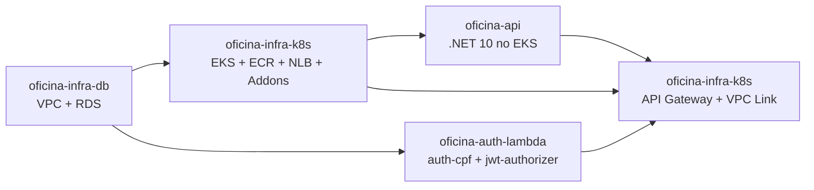
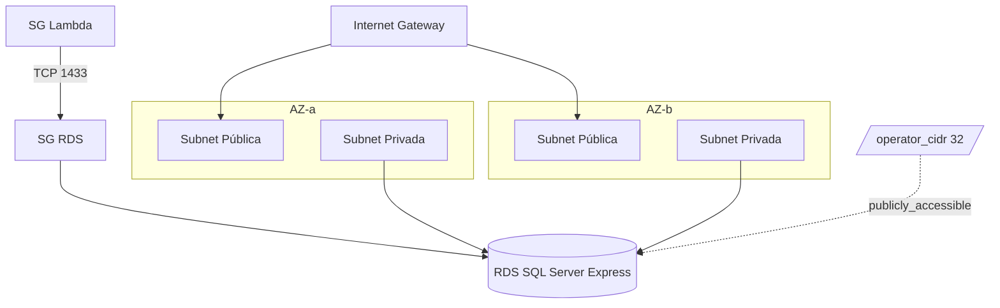

# oficina-infra-db

Camada de rede e banco de dados da solução Oficina na AWS.

[]()
[]()
[]()

## Sumário

- 🎯 [Visão geral](#visão-geral)
- 🧩 [Solução integrada](#solução-integrada)
- 🏗️ [Arquitetura](#arquitetura)
- 🔄 [Consumido e gerado](#consumido-e-gerado)
- ⚙️ [Configuração](#configuração)
- ▶️ [Execução](#execução)
- ✅ [Validação](#validação)
- 📊 [Observabilidade](#observabilidade)
- ➡️ [Próxima etapa](#próxima-etapa)

---

## <a id="visão-geral"></a> 🎯 Visão geral

Primeiro passo da solução. Provisiona via Terraform a base de rede (VPC, subnets públicas e privadas em duas AZs, Internet Gateway, Security Groups) e a instância Amazon RDS SQL Server Express.

- Expõe outputs consumidos pelos demais repositórios via remote state S3.
- Cria o bucket de state automaticamente, com versionamento, AES256 e bloqueio público.
- Não cria roles IAM, ECR, EKS, Lambdas, API Gateway nem DNS público.

**Tecnologias:** Terraform, AWS VPC, RDS SQL Server Express, S3 (state remoto), GitHub Actions.

---

## <a id="solução-integrada"></a> 🧩 Solução integrada

A solução Oficina é composta por 4 repositórios que formam um sistema de gestão de oficina mecânica na AWS.



| Passo | Repositório | Quando |
|---|---|---|
| **1** | **[oficina-infra-db](https://github.com/fabianorodrigues/oficina-infra-db)** | **sempre — este repositório** |
| 2 | [oficina-infra-k8s](https://github.com/fabianorodrigues/oficina-infra-k8s) — core + addons | sempre |
| 3 | [oficina-api](https://github.com/fabianorodrigues/oficina-api) — 1º deploy | sempre |
| 4 | [oficina-auth-lambda](https://github.com/fabianorodrigues/oficina-auth-lambda) | sempre |
| 5 | [oficina-infra-k8s](https://github.com/fabianorodrigues/oficina-infra-k8s) — api-gateway | sempre |
| 6 | [oficina-api](https://github.com/fabianorodrigues/oficina-api) — redeploy | opcional, se `public-base-url` precisa entrar nos e-mails |
| 7 | [oficina-infra-k8s](https://github.com/fabianorodrigues/oficina-infra-k8s) — observability | opcional, após o passo 5 |

> [!NOTE]
> No passo 2, o Metrics Server é sempre instalado (HPA da API depende dele); o AWS Load Balancer Controller só é instalado quando `LOAD_BALANCER_PROVISIONING_MODE=aws_lbc`.

---

## <a id="arquitetura"></a> 🏗️ Arquitetura



State remoto em `s3://<bucket-de-state>/oficina-infra-db/<ambiente>/terraform.tfstate`, com criptografia e lock S3.

---

## <a id="consumido-e-gerado"></a> 🔄 Consumido e gerado

**Consome:** nenhum repositório (primeiro passo).

**Gera (outputs consumidos via remote state S3):**

| Output | Consumido por |
| --- | --- |
| `vpc_id`, `vpc_cidr_block`, `public_subnet_ids`, `private_subnet_ids` | `oficina-infra-k8s` (core + api-gateway) |
| `lambda_subnet_id`, `lambda_security_group_id` | `oficina-auth-lambda` |
| `db_address`, `db_port`, `db_name` | `oficina-api`, `oficina-auth-lambda` |

---

## <a id="configuração"></a> ⚙️ Configuração

Configure em **GitHub > Settings > Secrets and variables > Actions**.

### Obrigatórios

| Nome | Tipo | Descrição |
| --- | --- | --- |
| `AWS_ACCESS_KEY_ID` | Secret | Credencial AWS |
| `AWS_SECRET_ACCESS_KEY` | Secret | Credencial AWS |
| `AWS_REGION` | Secret | Região AWS |
| `TF_STATE_BUCKET` | Secret | Nome do bucket S3 do state |
| `TF_VAR_db_username` | Secret | Admin SQL Server (1–128 chars, começa com letra) |
| `TF_VAR_db_password` | Secret | Senha SQL Server (8–128 chars) |

### Opcionais

| Nome | Tipo | Default | Descrição |
| --- | --- | --- | --- |
| `AWS_SESSION_TOKEN` | Secret | — | Credenciais temporárias (STS) |
| `TF_VAR_operator_cidr` | Secret | vazio | IPv4 `/32` para acesso operacional ao RDS |
| `PROJECT_NAME` | Variable | `oficina` | Prefixo lógico |
| `ENVIRONMENT` | Variable | `dev` | Ambiente |
| `TF_VAR_aws_region` | Variable | `us-east-1` | Região aplicada ao provider |
| `TF_VAR_vpc_cidr` | Variable | `10.30.0.0/16` | CIDR da VPC |
| `TF_VAR_db_instance_class` | Variable | `db.t3.micro` | Classe RDS |
| `TF_VAR_allocated_storage` | Variable | `20` | GB (20–100) |
| `TF_VAR_backup_retention_period` | Variable | `0` | Dias (0–35) |

> [!WARNING]
> Preencher `TF_VAR_operator_cidr` habilita `publicly_accessible=true` no RDS e libera TCP 1433 para o `/32` informado. Use apenas em acesso operacional temporário.

### Auto-provisionado pelo workflow

- Bucket S3 do state, se ainda não existir, com versionamento, criptografia AES256 e bloqueio público.
- Lock de execução via S3 (impede `apply` paralelo).

---

## <a id="execução"></a> ▶️ Execução

Pull requests executam `Terraform Check` (`fmt`, `init -backend=false`, `validate`), sem acessar a AWS.

Após o merge na `main`, dispare manualmente:

```text
GitHub Actions > Terraform Apply > Run workflow
```

O workflow prepara o backend S3, valida secrets obrigatórios, roda `plan`, aplica o Terraform e valida o estado do RDS sem expor connection string, endpoint ou valores sensíveis.

---

## <a id="validação"></a> ✅ Validação

### Console

- **S3**: bucket de state com versionamento, criptografia e bloqueio público.
- **VPC**: subnets públicas e privadas com tags do projeto.
- **RDS**: instância `available`, engine SQL Server Express, `PubliclyAccessible` coerente com `TF_VAR_operator_cidr`.
- **Security Groups**: TCP 1433 restrito ao `/32` quando o acesso operacional estiver habilitado.

### CLI (PowerShell)

```powershell
$env:AWS_REGION="<regiao>"
$env:TF_STATE_BUCKET="<bucket-de-state>"
$env:PROJECT_NAME="oficina"

aws s3api get-bucket-versioning --bucket $env:TF_STATE_BUCKET --query "Status"
aws rds describe-db-instances --db-instance-identifier "$($env:PROJECT_NAME)-sqlserver" --region $env:AWS_REGION --query "DBInstances[0].{Status:DBInstanceStatus,Engine:Engine,PubliclyAccessible:PubliclyAccessible}"
aws ec2 describe-subnets --region $env:AWS_REGION --filters "Name=tag:Repository,Values=oficina-infra-db" --query "length(Subnets)"
```

---

## <a id="observabilidade"></a> 📊 Observabilidade

O RDS publica métricas no namespace `AWS/RDS` do CloudWatch automaticamente — sem agente externo ou secret adicional neste repositório.

Métricas relevantes: `CPUUtilization`, `DatabaseConnections`, `FreeStorageSpace`, `ReadIOPS`, `WriteIOPS`.

```powershell
$env:AWS_REGION="<regiao>"
$env:PROJECT_NAME="oficina"

aws cloudwatch list-metrics --namespace "AWS/RDS" `
  --dimensions Name=DBInstanceIdentifier,Value="$($env:PROJECT_NAME)-sqlserver" `
  --region $env:AWS_REGION --query "length(Metrics)"
```

---

## <a id="próxima-etapa"></a> ➡️ Próxima etapa

Executar [oficina-infra-k8s](https://github.com/fabianorodrigues/oficina-infra-k8s) — **passo 2 (core + addons)** — com o mesmo `TF_STATE_BUCKET`. O core consome `vpc_id`, `public_subnet_ids` e `private_subnet_ids` deste repositório via remote state S3.
