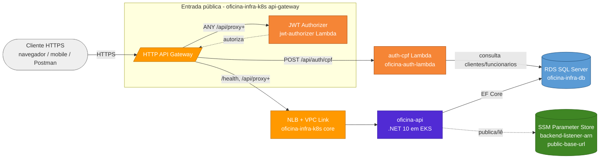
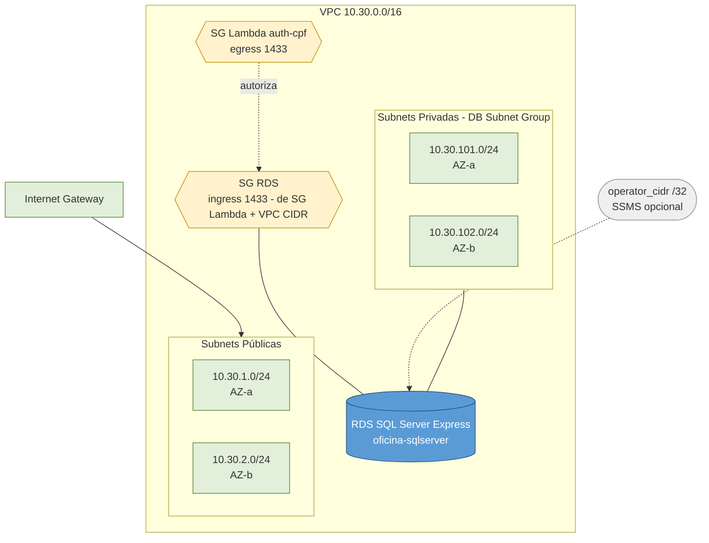

# oficina-infra-db

Camada de rede e banco de dados da solução Oficina na AWS.

[]()
[]()
[](https://github.com/fabianorodrigues/oficina-infra-db/actions/workflows/terraform-apply.yml)
[](https://github.com/fabianorodrigues/oficina-infra-db/actions/workflows/terraform-check.yml)

## Sumário

- 🎯 [Visão geral](#visão-geral)
- 🧩 [Solução integrada](#solução-integrada)
- 🏗️ [Arquitetura](#arquitetura)
- 🔄 [Consumido e gerado](#consumido-e-gerado)
- ⚙️ [Configuração](#configuração)
- ▶️ [Execução](#execução)
- ✅ [Validação](#validação)
- 📊 [Observabilidade](#observabilidade)
- ➡️ [Próxima etapa](#próxima-etapa)

---

## <a id="visão-geral"></a> 🎯 Visão geral

**Passo 1 de 7** da solução Oficina. Provisiona, via Terraform, a base de rede (VPC, subnets públicas e privadas em duas zonas de disponibilidade, Internet Gateway e Security Groups) e a instância Amazon RDS SQL Server Express que sustenta a aplicação.

- Expõe `outputs` consumidos pelos demais repositórios via remote state em S3.
- Cria o bucket de state automaticamente, com versionamento, criptografia AES256 e bloqueio público.
- Não cria roles IAM, ECR, EKS, Lambdas, API Gateway nem DNS público — cada camada é responsável pela própria identidade.

**Tecnologias:** Terraform 1.10+, AWS VPC, Amazon RDS SQL Server Express, S3 (state remoto), GitHub Actions.

---

## <a id="solução-integrada"></a> 🧩 Solução integrada

A solução Oficina é composta por 4 repositórios que formam, em conjunto, um sistema de gestão de oficina mecânica na AWS. O diagrama abaixo mostra o **fluxo de runtime** (setas sólidas) e o **fluxo de configuração** entre componentes (setas tracejadas).



| Passo | Repositório | Quando |
|---|---|---|
| **1** | **[oficina-infra-db](https://github.com/fabianorodrigues/oficina-infra-db)** | **sempre — este repositório** |
| 2 | [oficina-infra-k8s](https://github.com/fabianorodrigues/oficina-infra-k8s) — core + addons | sempre |
| 3 | [oficina-api](https://github.com/fabianorodrigues/oficina-api) — 1º deploy | sempre |
| 4 | [oficina-auth-lambda](https://github.com/fabianorodrigues/oficina-auth-lambda) | sempre |
| 5 | [oficina-infra-k8s](https://github.com/fabianorodrigues/oficina-infra-k8s) — api-gateway | sempre |
| 6 | [oficina-api](https://github.com/fabianorodrigues/oficina-api) — redeploy | opcional, se `public-base-url` precisa entrar nos e-mails |
| 7 | [oficina-infra-k8s](https://github.com/fabianorodrigues/oficina-infra-k8s) — observability | opcional, após o passo 5 |

---

## <a id="arquitetura"></a> 🏗️ Arquitetura



State remoto em `s3://<bucket-de-state>/oficina-infra-db/<ambiente>/terraform.tfstate`, com criptografia AES256 e lock S3 nativo.

---

## <a id="consumido-e-gerado"></a> 🔄 Consumido e gerado

**Consome:** nenhum repositório (primeiro passo da solução).

**Gera (outputs consumidos via remote state S3):**

| Output | Consumido por |
| --- | --- |
| `vpc_id`, `vpc_cidr_block`, `public_subnet_ids`, `private_subnet_ids` | `oficina-infra-k8s` (core + api-gateway) |
| `lambda_subnet_id`, `lambda_security_group_id` | `oficina-auth-lambda` |
| `db_address`, `db_port`, `db_name`, `db_instance_identifier` | `oficina-api`, `oficina-auth-lambda` |
| `db_connection_string_without_password` | referência consolidada para builders de connection string |
| `subnet_ids` (legado) | mantido apenas para compatibilidade com consumidores anteriores |

---

## <a id="configuração"></a> ⚙️ Configuração

Configure em **GitHub > Settings > Secrets and variables > Actions**.

### Secrets obrigatórios

| Nome | Descrição |
| --- | --- |
| `AWS_ACCESS_KEY_ID` | Credencial AWS |
| `AWS_SECRET_ACCESS_KEY` | Credencial AWS |
| `AWS_REGION` | Região AWS (também usada como `TF_VAR_aws_region`) |
| `TF_STATE_BUCKET` | Nome do bucket S3 do state remoto |
| `TF_VAR_db_username` | Administrador do SQL Server (1–128 caracteres, começa com letra) |
| `TF_VAR_db_password` | Senha do administrador (8–128 caracteres) |

### Secrets opcionais

| Nome | Descrição |
| --- | --- |
| `AWS_SESSION_TOKEN` | Credenciais temporárias (STS) |
| `TF_VAR_operator_cidr` | IPv4 `/32` para acesso operacional ao RDS (habilita `publicly_accessible=true`) |

### Variables opcionais

| Nome | Default | Descrição |
| --- | --- | --- |
| `PROJECT_NAME` | `oficina` | Prefixo lógico aplicado em nomes e tags |
| `ENVIRONMENT` | `dev` | Nome do ambiente (entra como sufixo na key do state) |

> [!WARNING]
> Preencher `TF_VAR_operator_cidr` habilita `publicly_accessible=true` no RDS e libera TCP 1433 para o `/32` informado. Use apenas em janelas operacionais temporárias e remova o secret depois.

### Customizações fora do workflow

Os demais parâmetros (`vpc_cidr`, `db_instance_class`, `allocated_storage`, `backup_retention_period`, `db_name`, `skip_final_snapshot`) têm defaults em [terraform/variables.tf](terraform/variables.tf) e podem ser sobrescritos via `terraform.tfvars` local (não versionado) — útil para execução manual fora do GitHub Actions.

### Auto-provisionado pelo workflow

- Bucket S3 do state, se ainda não existir, com versionamento, criptografia AES256 e bloqueio público total.
- Lock de execução nativo no S3 (`use_lockfile=true`), impedindo `apply` paralelo.
- Variáveis derivadas: `TF_VAR_aws_region`, `TF_VAR_project_name`, `TF_VAR_environment`.

---

## <a id="execução"></a> ▶️ Execução

Pull requests disparam o workflow **Terraform Check** (`fmt`, `init -backend=false`, `validate`) sem acessar a AWS.

Após o merge na `main`, dispare manualmente:

```text
GitHub Actions > Terraform Apply > Run workflow
```

O workflow valida secrets obrigatórios, prepara o backend S3, executa `terraform plan`, aplica o plano e valida o estado final do RDS — tudo sem expor connection string, endpoint ou valores sensíveis em log.

---

## <a id="validação"></a> ✅ Validação

### Console AWS

- **S3:** bucket de state com versionamento habilitado, criptografia AES256 e bloqueio público.
- **VPC:** subnets públicas e privadas em duas AZs, com as tags do projeto.
- **RDS:** instância `available`, engine `sqlserver-ex`, `PubliclyAccessible` coerente com o valor de `TF_VAR_operator_cidr`.
- **Security Groups:** TCP 1433 restrito ao `/32` quando o acesso operacional estiver habilitado.

### CLI (PowerShell)

```powershell
$env:AWS_REGION="<regiao>"
$env:TF_STATE_BUCKET="<bucket-de-state>"
$env:PROJECT_NAME="oficina"

aws s3api get-bucket-versioning --bucket $env:TF_STATE_BUCKET --query "Status"
aws rds describe-db-instances --db-instance-identifier "$($env:PROJECT_NAME)-sqlserver" --region $env:AWS_REGION --query "DBInstances[0].{Status:DBInstanceStatus,Engine:Engine,PubliclyAccessible:PubliclyAccessible}"
aws ec2 describe-subnets --region $env:AWS_REGION --filters "Name=tag:Repository,Values=oficina-infra-db" --query "length(Subnets)"
```

---

## <a id="observabilidade"></a> 📊 Observabilidade

O RDS publica métricas no namespace `AWS/RDS` do CloudWatch automaticamente, sem agente externo nem secret adicional neste repositório.

Métricas relevantes para acompanhar: `CPUUtilization`, `DatabaseConnections`, `FreeStorageSpace`, `ReadIOPS`, `WriteIOPS`.

```powershell
$env:AWS_REGION="<regiao>"
$env:PROJECT_NAME="oficina"

aws cloudwatch list-metrics --namespace "AWS/RDS" `
  --dimensions Name=DBInstanceIdentifier,Value="$($env:PROJECT_NAME)-sqlserver" `
  --region $env:AWS_REGION --query "length(Metrics)"
```

---

## <a id="próxima-etapa"></a> ➡️ Próxima etapa

Executar [oficina-infra-k8s](https://github.com/fabianorodrigues/oficina-infra-k8s) — **passo 2 (core + addons)** — reaproveitando o mesmo `TF_STATE_BUCKET`. O core consome `vpc_id`, `public_subnet_ids` e `private_subnet_ids` deste repositório via remote state S3.

> [!TIP]
> **Checkpoint antes de seguir:** RDS com `DBInstanceStatus=available` e outputs publicados no S3 backend em `s3://<bucket>/oficina-infra-db/<ambiente>/terraform.tfstate`.
