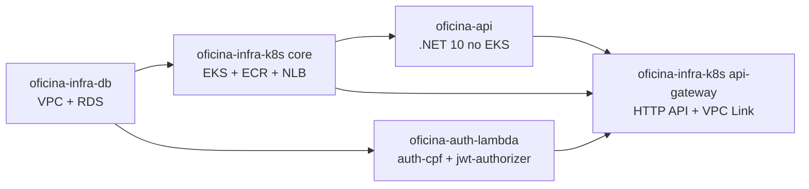
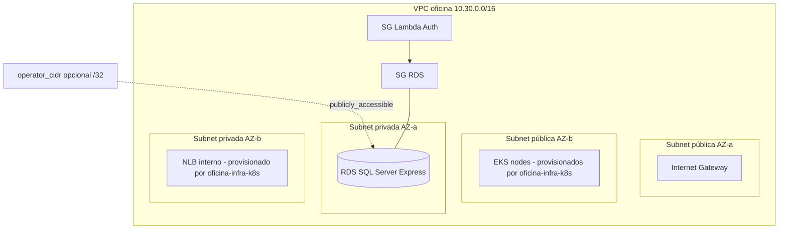

# oficina-infra-db

## Visão geral

Repositório que provisiona a base de rede e banco de dados da solução Oficina na AWS. Cria VPC, subnets públicas e privadas, Security Groups e a instância Amazon RDS SQL Server Express. É o ponto de partida da cadeia de deploy: os demais repositórios consomem seus outputs.

## Tecnologias utilizadas

- Terraform
- AWS VPC, Subnets, Internet Gateway, Security Groups
- AWS RDS SQL Server Express
- AWS S3 (state remoto)
- GitHub Actions

## Solução integrada

A solução Oficina é composta por 4 repositórios independentes que, juntos, formam um sistema de gestão de oficina mecânica na AWS.



| Passo | Repositório | Workflow | Quando aplicar |
|---|---|---|---|
| 1 | `oficina-infra-db` | Terraform Apply | sempre |
| 2 | `oficina-infra-k8s` root `terraform` (core) | Terraform Apply | sempre |
| 2a | `oficina-infra-k8s` root `terraform/addons` | Terraform Apply | apenas se `LOAD_BALANCER_PROVISIONING_MODE=aws_lbc` |
| 3 | `oficina-api` | Deploy API | sempre |
| 4 | `oficina-auth-lambda` | Deploy Lambda | sempre |
| 5 | `oficina-infra-k8s` root `terraform/api-gateway` | Terraform API Gateway Apply | sempre |
| 6 | `oficina-api` | Deploy API (redeploy) | se o pod precisar refletir `public-base-url` recém-criado em e-mails |

Cada README detalha apenas a responsabilidade do seu repositório. Para o passo a passo dos demais, consulte os READMEs correspondentes.

## Responsabilidade deste repositório

- Provisiona a base de rede (VPC, subnets públicas e privadas, Internet Gateway, Security Groups) e a instância RDS SQL Server Express.
- Expõe outputs consumidos pelos demais repositórios via remote state S3 e via filtros AWS CLI.
- Não cria roles IAM, ECR, EKS, Lambdas, API Gateway nem DNS público.

## Arquitetura



## Valores consumidos

Não há outputs consumidos de outros repositórios. Apenas credenciais AWS e parâmetros de configuração definidos em Secrets e Variables do GitHub Actions.

## Valores gerados

| Output | Consumido por | Como é consumido |
| --- | --- | --- |
| `vpc_id`, `vpc_cidr_block` | `oficina-infra-k8s` (todos os roots) | `data.terraform_remote_state.db` no S3 |
| `public_subnet_ids` | `oficina-infra-k8s` (root core) | remote state |
| `private_subnet_ids` | `oficina-infra-k8s` (root api-gateway) | remote state |
| `lambda_subnet_id` | `oficina-auth-lambda` | obtido via AWS CLI; configurado manualmente como Secret CSV |
| `lambda_security_group_id` | `oficina-auth-lambda` | obtido via AWS CLI; configurado manualmente como Secret CSV |
| `db_address`, `db_port`, `db_name` | `oficina-api`, `oficina-auth-lambda` | compõem o connection string configurado como Secret |

## Configuração necessária

Configure em `GitHub > Settings > Secrets and variables > Actions`:

| Nome | Tipo | Obrigatório | Origem ou Default | Descrição |
| --- | --- | --- | --- | --- |
| `AWS_ACCESS_KEY_ID` | Secret | Sim | — | Credencial AWS |
| `AWS_SECRET_ACCESS_KEY` | Secret | Sim | — | Credencial AWS |
| `AWS_SESSION_TOKEN` | Secret | Não | — | Credenciais temporárias (STS) |
| `AWS_REGION` | Secret | Sim | — | Região AWS |
| `TF_STATE_BUCKET` | Secret | Sim | Auto-provisionado pelo workflow | Bucket S3 do state; criado se não existir, com versionamento, criptografia AES256 e bloqueio público |
| `TF_VAR_db_username` | Secret | Sim | — | Usuário administrador do SQL Server (1 a 128 caracteres, começa com letra) |
| `TF_VAR_db_password` | Secret | Sim | — | Senha do SQL Server (8 a 128 caracteres) |
| `TF_VAR_operator_cidr` | Secret | Não | vazio (RDS privado) | IPv4 `/32` autorizado para acesso operacional ao RDS; preenchido habilita `publicly_accessible=true` |
| `PROJECT_NAME` | Variable | Não | `oficina` | Prefixo lógico em nomes e tags |
| `ENVIRONMENT` | Variable | Não | `dev` | Ambiente |
| `TF_VAR_aws_region` | Variable | Não | `us-east-1` | Região AWS aplicada ao provider |
| `TF_VAR_vpc_cidr` | Variable | Não | `10.30.0.0/16` | CIDR da VPC |
| `TF_VAR_db_instance_class` | Variable | Não | `db.t3.micro` | Classe RDS |
| `TF_VAR_allocated_storage` | Variable | Não | `20` | Armazenamento em GB (20 a 100) |
| `TF_VAR_backup_retention_period` | Variable | Não | `0` | Retenção de backup em dias (0 a 35) |

`TF_VAR_operator_cidr` controla o acesso operacional ao SQL Server:

- vazio ou ausente: o RDS permanece privado dentro da VPC;
- preenchido com `/32`: TCP `1433` liberado somente para esse IP, útil para conexão via SSMS.

## Como executar

Pull requests executam `Terraform Check` com `fmt`, `init -backend=false` e `validate`.

Após o merge na `main`, execute manualmente:

```text
GitHub Actions > Terraform Apply > Run workflow
```

O workflow prepara o backend S3, executa `plan`, aplica o Terraform e valida o estado do RDS sem imprimir connection string, endpoint ou valores sensíveis.

## Como validar pela AWS

### Console

- Em S3, confirme o bucket de state com versionamento, criptografia e bloqueio público.
- Em VPC, confirme subnets públicas e privadas com as tags do projeto.
- Em RDS, confirme a instância `available`, engine SQL Server Express e acesso público apenas quando `TF_VAR_operator_cidr` estiver configurado.
- Em Security Groups, confirme TCP `1433` restrito ao `/32` quando o acesso operacional estiver habilitado.

### CLI (PowerShell)

```powershell
$env:AWS_REGION="<regiao>"
$env:TF_STATE_BUCKET="<bucket-de-state>"
$env:PROJECT_NAME="oficina"

aws s3api get-bucket-versioning --bucket $env:TF_STATE_BUCKET --query "Status"
aws rds describe-db-instances --db-instance-identifier "$($env:PROJECT_NAME)-sqlserver" --region $env:AWS_REGION --query "DBInstances[0].{Status:DBInstanceStatus,Engine:Engine,PubliclyAccessible:PubliclyAccessible}"
aws ec2 describe-subnets --region $env:AWS_REGION --filters "Name=tag:Repository,Values=oficina-infra-db" --query "length(Subnets)"
```

## Como executar localmente

Apenas validações não destrutivas. Não execute `apply` local.

```powershell
cd oficina-infra-db/terraform
terraform fmt -check -recursive
terraform init -backend=false
terraform validate
```

Para `plan` local em ambiente próprio, use `terraform.tfvars` não versionado a partir do exemplo do repositório.

## Monitoramento e Observabilidade

A camada de dados expõe métricas nativas do RDS via CloudWatch. Não há agente externo neste repositório.

### Configurar

- Não há secrets adicionais. As métricas básicas do RDS (`CPUUtilization`, `DatabaseConnections`, `FreeStorageSpace`, `ReadIOPS`, `WriteIOPS`) são publicadas automaticamente no namespace `AWS/RDS`.
- Enhanced Monitoring e Performance Insights estão desabilitados por padrão. Para habilitá-los, edite os atributos `monitoring_interval` e `performance_insights_enabled` em `terraform/rds.tf` (fora do escopo padrão deste repositório).

### Executar

Nada a executar — as métricas básicas são habilitadas automaticamente pelo RDS na criação da instância.

### Validar

Console:

- CloudWatch > Metrics > AWS/RDS, confirme série temporal para `DBInstanceIdentifier=<projeto>-sqlserver`.

CLI (PowerShell):

```powershell
$env:AWS_REGION="<regiao>"
$env:PROJECT_NAME="oficina"

aws cloudwatch list-metrics --namespace "AWS/RDS" `
  --dimensions Name=DBInstanceIdentifier,Value="$($env:PROJECT_NAME)-sqlserver" `
  --region $env:AWS_REGION --query "length(Metrics)"
```

## Próxima etapa

Executar `oficina-infra-k8s` root `terraform` (core) com o mesmo `TF_STATE_BUCKET`, para consumir a VPC e as subnets criadas por este repositório via remote state.
